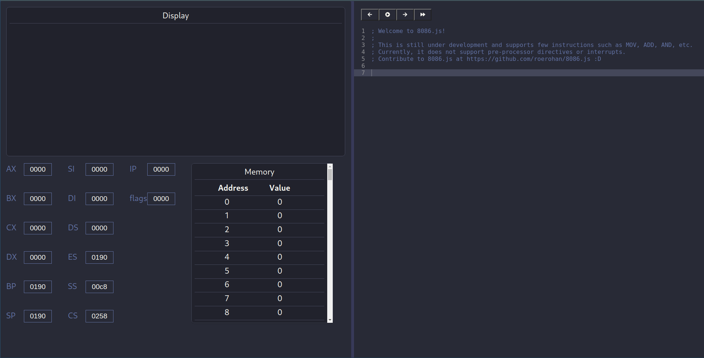

[![Issues][issues-shield]][issues-url]
<!-- ALL-CONTRIBUTORS-BADGE:START - Do not remove or modify this section -->
[](#contributors-)
<!-- ALL-CONTRIBUTORS-BADGE:END -->

<!-- PROJECT LOGO -->
<br />
<p align="center">
  <a href="https://github.com/roerohan/8086.js">
    
  </a> 

  <!-- <h3 align="center">8086.js</h3> -->

  <p align="center">
    A basic web-based 8086 emulator built with Javascript.
    <br />
    <a href="https://github.com/roerohan/8086.js"><strong>Explore the docs »</strong></a>
    <br />
    <br />
    <a href="https://github.com/roerohan/8086.js">View Demo</a>
    ·
    <a href="https://github.com/roerohan/8086.js/issues">Report Bug</a>
    ·
    <a href="https://github.com/roerohan/8086.js/issues">Request Feature</a>
  </p>
</p>


<!-- TABLE OF CONTENTS -->
## Table of Contents

* [About the Project](#about-the-project)
  * [Built With](#built-with)
* [Getting Started](#getting-started)
  * [Prerequisites](#prerequisites)
  * [Installation](#installation)
* [Usage](#usage)
* [Basic Workflow](#basic-workflow)
* [Roadmap](#roadmap)
* [Contributing](#contributing)
* [License](#license)
* [Contributors](#contributors-)


<!-- ABOUT THE PROJECT -->
## About The Project


`8086.js` is a basic 8086 emulator built using Javascript, hosted at [https://roerohan.github.io/8086.js/](https://roerohan.github.io/8086.js/).



### Built With

* [React.js](https://arkdownreactjs.org/docs/getting-started.html)
* [Redux](https://redux.js.org/tutorials/essentials/part-1-overview-concepts)
* [Material UI](https://material-ui.com/getting-started/usage/)
* [Ace](https://github.com/ajaxorg/ace)


<!-- GETTING STARTED -->
## Getting Started

To get a local copy up and running follow these simple steps.

### Prerequisites

You will need the following to be able to run the project.

* [npm](https://www.npmjs.com/) or [yarn](https://yarnpkg.com/)
* [node (Node.js)](https://nodejs.org)


### Installation
 
1. Clone the Repo

```sh
git clone https://github.com/roerohan/8086.js.git
```

2. Install NPM packages using (npm or yarn)

### Using npm

```sh
npm install
```

### Using yarn

```
yarn install
```

**Note:** If installing the packages with `npm` you get errors use `yarn` to install them.


<!-- USAGE EXAMPLES -->
## Usage

> Note: `8086.js` does not support all instructions, pre-processor directives and interrupts yet. You can check out the supported instructions in the `switch-case` [here](./src/emulator/cpu/core.js).

To run the React App locally, you can run the following command.

1. Run the React App

### Using npm

```sh
npm start
```

### Using yarn

```sh
yarn start
```

## Basic Workflow

The UI is split into 2 major halves, the right half is the `editor` and the left half is the `emulator`. Instructions can be written in the editor, and when they are executed, the registers and memory in the emulator get updated accordingly. There are a few steps which happen in the background to make this possible.

1. An object of the [Emulator](./src/emulator/emulator.js) class is exported, which is the point of interaction between the frontend and the emulation logic.

2. First, the [lexer](./src/emulator/parser/lexer.js) divides the source code into tokens and sends them to a [parser](./src/emulator/parser/parser.js). The parser is responsible for extracting instructions from the tokens and converting them to a form that the `CPU` understands.

3. The [CPU](./src/emulator/cpu/core.js) reads the mnemonic and the operands that were sent to it by the parser, and according to these values, it executes the instructions.

> Note: The communication between the parser and the CPU is NOT in terms of `shellcode`, i.e, `opcode`s and `operands`. The CPU recognizes an instruction by it's `mnemonic`, such as `MOV` or `ADD`. 


<!-- _For more examples, please refer to the [Documentation](https://example.com)_ -->


<!-- ROADMAP -->
## Roadmap

See the [open issues](https://github.com/roerohan/8086.js/issues) for a list of proposed features (and known issues).


<!-- CONTRIBUTING -->
## Contributing

Contributions are what make the open source community such an amazing place to be learn, inspire, and create. Any contributions you make are **greatly appreciated**.

1. Fork the Project
2. Create your Feature Branch (`git checkout -b feature/AmazingFeature`)
3. Commit your Changes (`git commit -m 'feat: Add some AmazingFeature'`)
4. Push to the Branch (`git push origin feature/AmazingFeature`)
5. Open a Pull Request

You are requested to follow the contribution guidelines specified in [CONTRIBUTING.md](./CONTRIBUTING.md) while contributing to the project :smile:.

<!-- LICENSE -->
## License

Distributed under the MIT License. See [`LICENSE`](./LICENSE) for more information.


<!-- MARKDOWN LINKS & IMAGES -->
<!-- https://www.markdownguide.org/basic-syntax/#reference-style-links -->
[roerohan-url]: https://roerohan.github.io
[issues-shield]: https://img.shields.io/github/issues/othneildrew/Best-README-Template.svg?style=flat-square
[issues-url]: https://github.com/roerohan/8086.js/issues

## Contributors ✨

Thanks goes to these wonderful people ([emoji key](https://allcontributors.org/docs/en/emoji-key)):

<!-- ALL-CONTRIBUTORS-LIST:START - Do not remove or modify this section -->
<!-- prettier-ignore-start -->
<!-- markdownlint-disable -->
<table>
  <tr>
    <td align="center"><a href="https://github.com/roerohan"><br /><sub><b>Rohan Mukherjee</b></sub></a><br /><a href="https://github.com/roerohan/8086.js/commits?author=roerohan" title="Code">💻</a> <a href="https://github.com/roerohan/8086.js/commits?author=roerohan" title="Documentation">📖</a></td>
    <td align="center"><a href="https://github.com/thebongy"><br /><sub><b>Rishit Bansal</b></sub></a><br /><a href="https://github.com/roerohan/8086.js/commits?author=thebongy" title="Code">💻</a> <a href="https://github.com/roerohan/8086.js/commits?author=thebongy" title="Documentation">📖</a></td>
    <td align="center"><a href="https://github.com/ritika-07"><br /><sub><b>Ritika</b></sub></a><br /><a href="https://github.com/roerohan/8086.js/commits?author=ritika-07" title="Code">💻</a></td>
    <td align="center"><a href="https://github.com/capellini"><br /><sub><b>Rob Capellini</b></sub></a><br /><a href="https://github.com/roerohan/8086.js/commits?author=capellini" title="Code">💻</a></td>
    <td align="center"><a href="https://josesp.netlify.com/"><br /><sub><b>Jose M. Segura Polanco</b></sub></a><br /><a href="https://github.com/roerohan/8086.js/commits?author=DarkCode01" title="Code">💻</a></td>
    <td align="center"><a href="https://devenv.now.sh/"><br /><sub><b>Pranav P</b></sub></a><br /><a href="https://github.com/roerohan/8086.js/commits?author=pranavp10" title="Code">💻</a></td>
    <td align="center"><a href="https://ffcs.ooo"><br /><sub><b>Namit Nathwani</b></sub></a><br /><a href="https://github.com/roerohan/8086.js/commits?author=namsnath" title="Code">💻</a></td>
  </tr>
  <tr>
    <td align="center"><a href="https://github.com/Sanjana-R"><br /><sub><b>Sanjana Rai</b></sub></a><br /><a href="https://github.com/roerohan/8086.js/commits?author=Sanjana-R" title="Documentation">📖</a></td>
  </tr>
</table>

<!-- markdownlint-enable -->
<!-- prettier-ignore-end -->
<!-- ALL-CONTRIBUTORS-LIST:END -->

This project follows the [all-contributors](https://github.com/all-contributors/all-contributors) specification. Contributions of any kind welcome!
